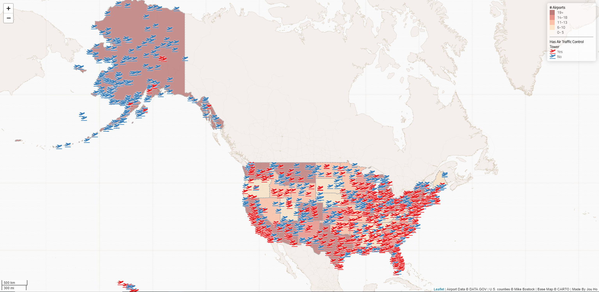

## Map of Airports in the United States

### Project Description

This is an interactive web map that marks all the airports in the United States. The color of the airport icon indicates whether the airport has an air traffic control tower (ATCT). Red icon indicates that it has the ATCT and blue icon indicates that there is no ATCT. This map also divides the United States into each states and the color of each states indicates how many airports are there.

#### Data Source
- `airports.geojson` contains all the airports in the United States. This data is converted from a shapefile, which was downloaded and unzipped from  https://catalog.data.gov/dataset/usgs-small-scale-dataset-airports-of-the-united-states-201207-shapefile.
- `us-states.geojson` is a geojson data file containing all the states' boundaries of the United States. This data is acquired from [Mike Bostock](http://bost.ocks.org/mike) of [D3](http://d3js.org/).

#### Acknowledgement
This map is created by Jou Ho, and is made with reference to a Web Map Design tutorial found [here](https://github.com/jakobzhao/geog458/tree/master/labs/lab03).
